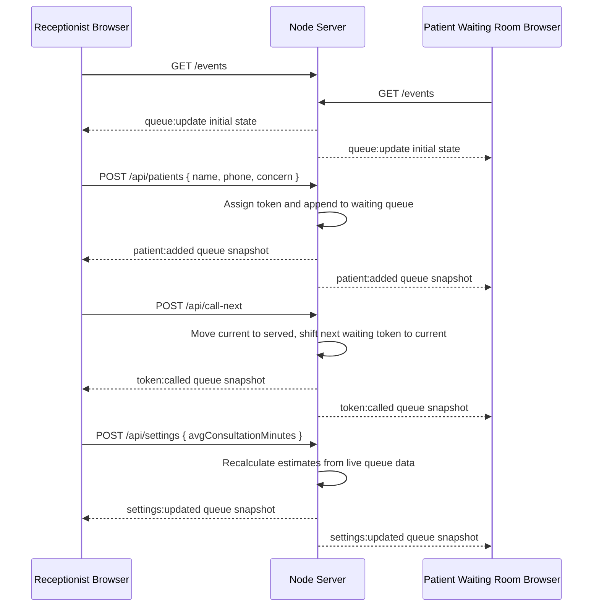

# Socket Event Diagram

This prototype uses Server-Sent Events for live browser sync. The behavior is the same live-update pattern expected from sockets: clients subscribe once, then receive queue events immediately after receptionist actions.

## Events

| Event | Trigger | Payload |
| --- | --- | --- |
| `queue:update` | Client connects | Full queue snapshot |
| `patient:added` | Receptionist adds patient | Full queue snapshot |
| `token:called` | Receptionist clicks Call Next | Full queue snapshot |
| `settings:updated` | Average consultation time changes | Full queue snapshot |

Every event sends a complete state snapshot so a reconnecting or slightly stale browser can recover without replaying old events.
